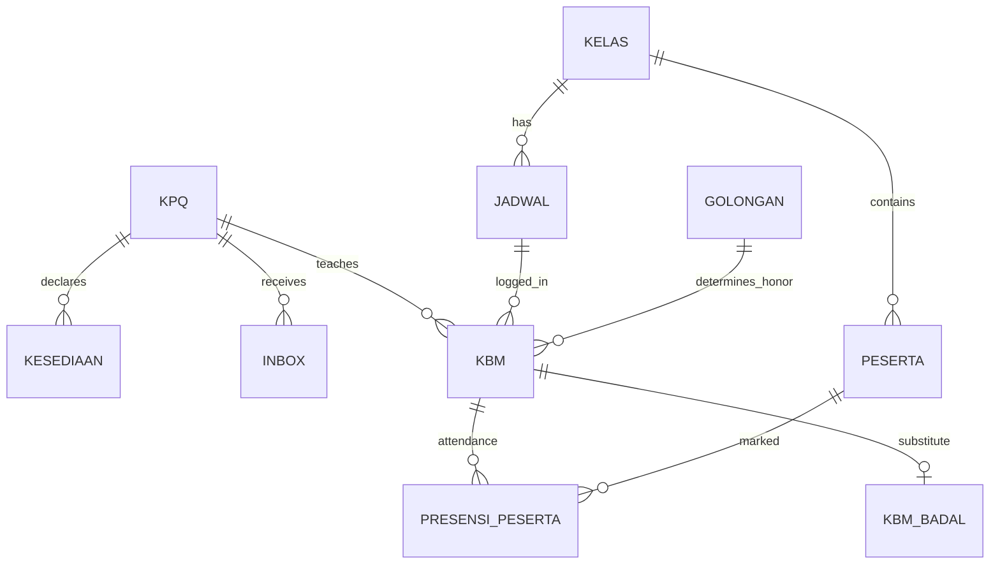

# Shared Models & Database

Dokumen referensi untuk model bersama dan entitas database yang dipakai lintas fitur.

## Main_model — CRUD Generik

**File:** `application/models/Main_model.php`

| Method | Signature | Return |
|--------|-----------|--------|
| `add_data` | `($table, $data)` | `insert_id` |
| `get_one` | `($table, $where)` | `row_array` |
| `get_all` | `($table, $where='', $order='', $by='ASC')` | `result_array` |
| `get_all_group_by` | `($table, $where='', $group='')` | `result_array` |
| `edit_data` | `($table, $where, $data)` | `affected_rows` |
| `delete_data` | `($table, $where)` | `affected_rows` |
| `nominal` | `($nominal)` | Parse string Rupiah ke angka |
| `get_last_id` | `($table, $col)` | Row dengan ID terakhir |

**Kapan pakai:** operasi CRUD sederhana tanpa join kompleks.

## Civitas_model — Logika Bisnis KPQ

**File:** `application/models/Civitas_model.php`

### Jadwal & Kelas

| Method | Deskripsi |
|--------|-----------|
| `get_all_jadwal_kpq($nip)` | Semua jadwal (R+PK+PL), sorted by jam |
| `get_jadwal_hari_kpq($nip, $hari)` | Filter per hari |
| `get_data_jadwal($id_jadwal)` | Satu record jadwal |
| `get_all_program()` | Dropdown program |
| `get_all_kpq()` | Daftar pengajar aktif |
| `get_peserta_aktif($id_kelas)` | Peserta status aktif |

### KBM & Presensi

| Method | Deskripsi |
|--------|-----------|
| `get_kbm_now($nip)` | KBM bulan ini (exclude badal) |
| `get_kbm_by_id_jadwal($id)` | KBM per jadwal bulan ini |
| `get_detail_kbm($id_jadwal)` | Detail + presensi (AJAX) |
| `get_total_kbm_by_jadwal_now($id)` | Count KBM untuk OT |
| `add_kbm()` | Insert KBM + presensi |
| `delete_kbm($id)` | Legacy — pakai Main_model |

### Badal

| Method | Deskripsi |
|--------|-----------|
| `get_badal_now($nip)` | Sebagai pembadal |
| `get_dibadal_now($nip)` | KBM sendiri yang dibadal |
| `get_all_jadwal_badal_kpq($nip)` | Jadwal badal belum rekap |
| `get_catatan_badal($id_kbm)` | Catatan badal |
| `add_badal()` | Ajukan badal |
| `rekap_badal()` | Rekap + presensi + honor |

### Waiting List & Kesediaan

| Method | Deskripsi |
|--------|-----------|
| `get_all_wl()` | WL tersedia (filter jk) |
| `get_wl_konfirm($nip)` | WL milik user status konfirm |
| `ambil_kelas_wl($id)` | Claim kelas |
| `batal_wl($id_kelas)` | Batalkan claim |
| `get_all_kesediaan($nip)` | Slot kesediaan |
| `get_catatan_kelas($id)` | Catatan + tempat kelas |

### Inbox & Profil

| Method | Deskripsi |
|--------|-----------|
| `get_all_inbox($nip)` | Semua pesan |
| `get_all_inbox_off($nip)` | Unread count |
| `edit_status_inbox($nip)` | Mark all read |
| `get_data_kpq($nip)` | Profil pengajar |
| `get_detail_golongan($id)` | Tarif golongan |
| `get_detail_ot($id)` | Tarif OT hardcoded |

## Login_model

**File:** `application/models/Login_model.php`

| Method | Deskripsi |
|--------|-----------|
| `cek_login()` | Validasi NIK + password |
| `status_login($nip)` | Set `kpq.login = 1` |

---

## Entity Relationship (Logical)



## Tabel Database

### `kpq` — Data Pengajar
| Kolom | Keterangan |
|-------|------------|
| `nip` | PK / NIK |
| `nama_kpq` | Nama |
| `golongan` | A–E |
| `jk` | Jenis kelamin (filter WL) |
| `t4_lahir`, `tgl_lahir`, `no_hp`, `alamat` | Profil |
| `pendidikan`, `jurusan`, `no_ktp`, `tgl_masuk` | Profil |
| `status` | aktif/nonaktif |
| `login` | Flag login |

### `admin` — Akun Login
| Kolom | Keterangan |
|-------|------------|
| `id_admin` | = nip |
| `password` | Plain text |
| `level` | `kpq` |

### `kelas` — Kelas (PV umum)
| Kolom | Keterangan |
|-------|------------|
| `id_kelas` | PK |
| `program`, `tipe_kelas` | |
| `nip` | Pengajar (null jika WL) |
| `status` | `aktif`, `wl`, `konfirm` |
| `pengajar` | Pria / Wanita / Pria&Wanita |
| `catatan`, `tempat` | |

### View/Tabel Jadwal Khusus
- `kelas_reguler` — kelas reguler + jadwal embedded
- `kelas_pv_khusus` — privat khusus
- `kelas_pv_luar` — privat luar

### `jadwal`
| Kolom | Keterangan |
|-------|------------|
| `id_jadwal` | PK |
| `id_kelas` | FK |
| `hari`, `jam`, `tempat` | |
| `ot` | Level OT (1–3) |
| `status` | aktif |

### `kbm`
| Kolom | Keterangan |
|-------|------------|
| `id_kbm` | PK (manual increment di kode) |
| `tgl`, `hari`, `jam` | |
| `nip` | Pengajar pemilik KBM |
| `id_kelas`, `id_jadwal` | |
| `keterangan` | sesuai / ganti / badal |
| `biaya` | Honor |
| `ot` | OT amount |
| `jum_peserta` | |
| `program_kbm`, `peserta` | |

### `kbm_badal`
| Kolom | Keterangan |
|-------|------------|
| `id_kbm` | FK |
| `nip_badal` | Pengganti |
| `catatan` | HTML |
| `status` | on / konfirm |
| `rekap` | 0 / 1 |

### `presensi_peserta`
| Kolom | Keterangan |
|-------|------------|
| `id_kbm` | FK |
| `id_peserta` | FK |
| `hadir` | 1 / 0 |

### `kesediaan`
| Kolom | Keterangan |
|-------|------------|
| `nip`, `hari`, `jam` | |

### `inbox`
| Kolom | Keterangan |
|-------|------------|
| `id_inbox` | PK |
| `nip`, `judul`, `inbox`, `tgl_inbox` | |
| `status` | off / on |

### `golongan`
| Kolom | Keterangan |
|-------|------------|
| `gol` | Kode golongan |
| `tipe_kelas` | |
| `honor` | Tarif per KBM |

### `program`
| Kolom | Keterangan |
|-------|------------|
| `nama_program` | |

---

## Filter Waktu Umum

Banyak query memfilter **bulan dan tahun berjalan**:

```php
$bulan = date("m");
$tahun = date("Y");
// WHERE MONTH(tgl) = $bulan AND YEAR(tgl) = $tahun
```

Saat debug data "hilang", cek apakah `tgl` di bulan lain.

## Known Patterns / Pitfalls

1. **ID manual** — `add_kbm` dan `add_badal` generate `id_kbm` dengan MAX+1, bukan AUTO_INCREMENT
2. **SQL IN clause** — presensi membangun `NOT IN ('1', '2')` dari array PHP
3. **Session di model** — `get_all_wl()` pakai `$this->session->userdata('jk')` di dalam model
4. **Views DB** — `kelas_reguler`, `kelas_pv_*` mungkin view MySQL, bukan tabel fisik
