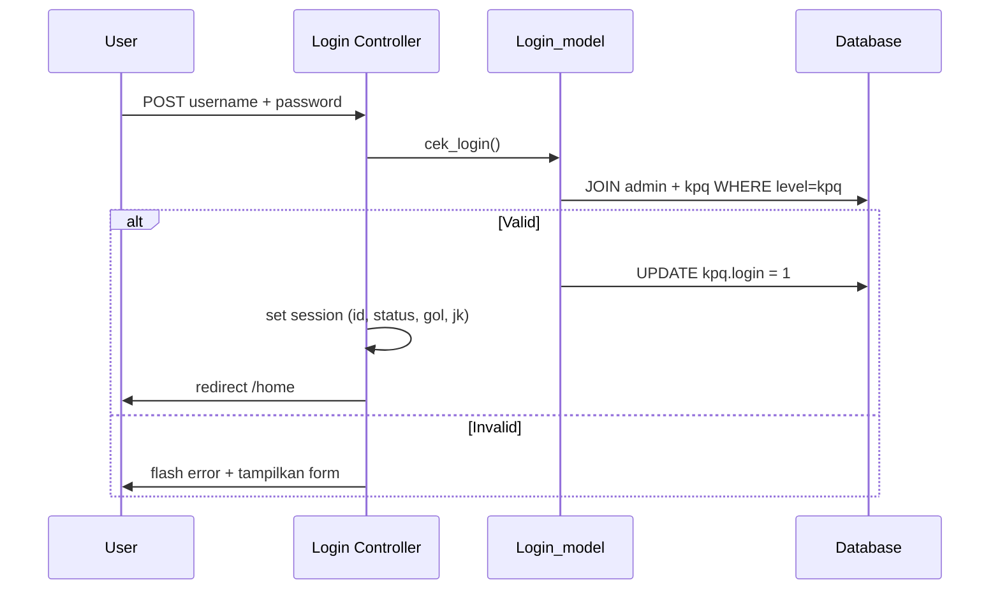

# Fitur 01 — Autentikasi & Login

## Ringkasan

Fitur login untuk pengajar KPQ menggunakan **NIK** dan **password**. Setelah berhasil, session dibuat dan pengguna diarahkan ke beranda (`home`).

## File Terkait

| Tipe | Path |
|------|------|
| Controller | `application/controllers/Login.php` |
| Model | `application/models/Login_model.php` |
| View | `application/views/login/login.php` |
| Template | `application/views/templates/header-login.php` |
| Template | `application/views/templates/footer.php` |

## Route / Endpoint

| Method | URL | Controller Method | Keterangan |
|--------|-----|-------------------|------------|
| GET | `/login` | `Login::index()` | Tampilkan form login |
| POST | `/login` | `Login::index()` → `cekLogin()` | Proses login |
| GET | `/login/logout` | `Login::logout()` | Hapus session, redirect ke login |

## Alur Login



## Form Login

| Field | Name | Validasi |
|-------|------|----------|
| NIK | `username` | required |
| Password | `password` | required, toggle show/hide via JS |

## Query Autentikasi

`Login_model::cek_login()`:

```sql
SELECT * FROM admin a
JOIN kpq b ON a.id_admin = b.nip
WHERE id_admin = :username
  AND password = :password
  AND level = 'kpq'
```

**Penting:** Password dibandingkan **plain text**, bukan hash.

## Session yang Dibuat

```php
[
    'id'     => $data['nip'],
    'status' => 'login',
    'gol'    => $data['golongan'],
    'jk'     => $data['jk']
]
```

## Tabel Database

| Tabel | Kolom Relevan |
|-------|---------------|
| `admin` | `id_admin`, `password`, `level` |
| `kpq` | `nip`, `golongan`, `jk`, `login` |

## Logout

`Login::logout()` memanggil `$this->session->sess_destroy()` lalu redirect ke `login`.

## UI/UX

- Judul Arab: أَهْلًا وَ سَهْلًا
- Flash `pesan` untuk error login
- Flash `login` ditampilkan jika user di-redirect karena belum login (dari controller lain)

## Tugas Umum untuk Developer

| Tugas | Lokasi Edit |
|-------|-------------|
| Tambah validasi form | `Login.php`, `login.php` |
| Hash password | `Login_model::cek_login()`, `Pengaturan::edit_password()` |
| Remember me | Tambah cookie + logic di `Login.php` |
| Rate limiting | Middleware/hook CI3 atau logic di `cekLogin()` |

## Known Issues / Tech Debt

- Password tidak di-hash
- Tidak ada CSRF token di form
- `status_login()` hanya set `login=1`, tidak pernah reset saat logout

## Testing Manual

1. Buka `/login`
2. Masukkan NIK + password valid → harus redirect ke `/home`
3. Masukkan password salah → alert merah
4. Akses `/home` tanpa login → redirect ke `/login`
5. Klik logout → session hilang
