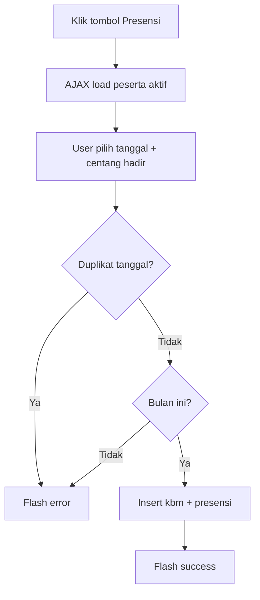

# Fitur 04 — Jadwal KBM

## Ringkasan

Fitur inti aplikasi. Pengajar melihat jadwal mengajar, menambah KBM dengan presensi, mengajukan badal, mengedit program kelas, dan melihat detail KBM bulan berjalan.

## File Terkait

| Tipe | Path |
|------|------|
| Controller | `application/controllers/Kelas.php` |
| Model | `application/models/Civitas_model.php`, `Main_model.php` |
| View | `application/views/page/kelas.php` |
| Template | `application/views/templates/header.php` |

## Route / Endpoint

| Method | URL | Method Controller | Keterangan |
|--------|-----|-------------------|------------|
| GET | `/kelas` | `index()` | Semua jadwal |
| GET | `/kelas/hari/{hari}` | `hari($hari)` | Filter per hari (senin, selasa, … ahad) |
| POST | `/kelas/add_kbm` | `add_kbm()` | Simpan KBM + presensi |
| POST | `/kelas/add_badal` | `add_badal()` | Ajukan badal |
| POST | `/kelas/edit_program` | `edit_program()` | Ubah program kelas PK/PL |
| GET | `/kelas/delete_kbm/{id}` | `delete_kbm($id)` | Hapus KBM |
| POST | `/kelas/get_peserta_aktif` | `get_peserta_aktif()` | AJAX |
| POST | `/kelas/get_detail_kbm` | `get_detail_kbm()` | AJAX |
| POST | `/kelas/get_catatan_kelas` | `get_catatan_kelas()` | AJAX |

> Halaman Badal dan Waiting List juga di controller `Kelas.php` — lihat dokumen fitur terpisah.

## Sumber Data Jadwal

`Civitas_model::get_all_jadwal_kpq($nip)` menggabungkan 3 sumber:

1. **Reguler (`R`)** — `kelas_reguler` WHERE `nip` AND `status='aktif'`
2. **PV Khusus (`PK`)** — `kelas_pv_khusus` + join `jadwal`
3. **PV Luar (`PL`)** — `kelas_pv_luar` + join `jadwal`

Hasil di-sort berdasarkan `jam`.

## Tampilan Kartu Kelas

Setiap kartu menampilkan:
- Hari, jam, tipe (R/PK/PL)
- Program, nama peserta, tempat
- Tombol aksi (jika `kbm < 5`):
  - **Presensi** (biru) → modal tambah KBM
  - **Badal** (merah) → modal ajukan badal
  - **Detail KBM** (hijau) → badge jumlah KBM

Edit program hanya untuk PK/PL dan **hanya tanggal 1–4** bulan (`date('d') < 5`).

## Tambah KBM (`add_kbm`)

### Validasi Controller
- Tidak boleh duplikat: same `tgl`, `nip`, `id_jadwal` di tabel `kbm`
- Tanggal harus di **bulan & tahun berjalan**

### Form Presensi (Modal)
Dua mode via tab:
- **Sesuai** — KBM sesuai jadwal (`keterangan = 'sesuai'`)
- **Ganti** — KBM beda hari/jam (`keterangan = 'ganti'`, pilih jam manual)

### POST Fields
| Field | Keterangan |
|-------|------------|
| `id_jadwal`, `id_kelas`, `koor` | Hidden |
| `tgl` | Tanggal KBM |
| `keterangan` | `sesuai` atau `ganti` |
| `jam` | Hanya jika ganti |
| `peserta_sesuai[]` / `peserta_ganti[]` | ID peserta hadir |

### Logic Model (`Civitas_model::add_kbm`)
1. Generate `id_kbm` manual (MAX+1)
2. Ambil honor dari `golongan` × `tipe_kelas`
3. Insert `kbm`
4. Insert `presensi_peserta`: hadir=1 untuk peserta dipilih, hadir=0 untuk sisanya

## Ajukan Badal (`add_badal`)

Lihat juga [05-jadwal-badal.md](05-jadwal-badal.md).

Validasi: tidak boleh sudah ada KBM di tanggal yang sama untuk jadwal tersebut.

POST: `tgl`, `waktu`, `catatan`, `tempat`, `nip` (pembadal), `id_jadwal`, `id_kelas`, `program`, `koor`

## Hapus KBM (`delete_kbm`)

```php
Main_model::delete_data('kbm', ['id_kbm' => $id, 'nip' => $nip])
```

Hanya KBM milik pengajar sendiri.

## AJAX Endpoints

### `get_peserta_aktif`
- Input: `id` (id_kelas)
- Output: JSON array peserta `status='aktif'`

### `get_detail_kbm`
- Input: `id` (id_jadwal)
- Output: JSON array KBM bulan ini + peserta hadir/tidak hadir + info badal

### `get_catatan_kelas`
- Input: `id` (id_kelas)
- Output: `{ catatan, tempat }`

## Tabel Database Terkait

| Tabel | Peran |
|-------|-------|
| `kelas_reguler`, `kelas_pv_khusus`, `kelas_pv_luar` | Data kelas |
| `jadwal` | Hari, jam, tempat, OT |
| `kelas` | Program, status (untuk edit program) |
| `kbm` | Record KBM |
| `presensi_peserta` | Kehadiran per KBM |
| `peserta` | Data siswa |
| `golongan` | Tarif honor |
| `program` | Daftar program (dropdown edit) |

## Diagram Alur Tambah KBM



## Tugas Umum untuk Developer

| Tugas | Lokasi |
|-------|--------|
| Ubah batas max KBM (5) | View `kelas.php` kondisi `$kelas['kbm'] < 5` |
| Ubah window edit program | View `date('d') < 5` |
| Fix ID KBM auto-increment | `Civitas_model::add_kbm` — gunakan DB auto increment |
| Tambah export rekap | Controller + view baru |

## Testing Manual

1. `/kelas` — tampil kartu sesuai NIP login
2. `/kelas/hari/senin` — hanya jadwal senin
3. Tambah KBM → cek `kbm` + `presensi_peserta`
4. Duplikat tanggal → error
5. Detail KBM modal → data AJAX benar
6. Hapus KBM → record hilang
