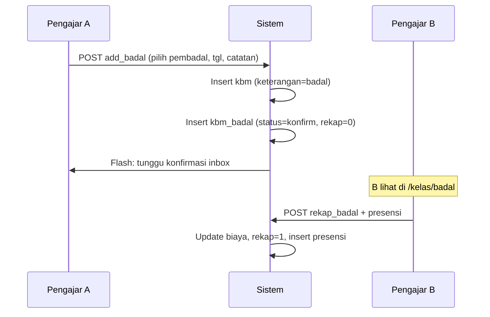

# Fitur 05 — Jadwal Badal

## Ringkasan

Mengelola KBM pengganti (badal). Pengajar bisa **mengajukan badal** dari halaman jadwal KBM, dan **merekap badal** (presensi) dari halaman jadwal badal ketika menjadi pembadal.

## File Terkait

| Tipe | Path |
|------|------|
| Controller | `application/controllers/Kelas.php` |
| Model | `application/models/Civitas_model.php`, `Main_model.php` |
| View jadwal badal | `application/views/page/badal.php` |
| View ajukan badal | Modal di `application/views/page/kelas.php` |
| Template | `application/views/templates/header.php` |

## Route / Endpoint

| Method | URL | Method | Keterangan |
|--------|-----|--------|------------|
| GET | `/kelas/badal` | `badal()` | Daftar badal bulan ini |
| POST | `/kelas/add_badal` | `add_badal()` | Ajukan badal (dari halaman KBM) |
| POST | `/kelas/rekap_badal` | `rekap_badal()` | Rekap presensi sebagai pembadal |
| POST | `/kelas/get_catatan_badal` | `get_catatan_badal()` | AJAX catatan badal |

## Konsep Badal

| Istilah | Arti |
|---------|------|
| **Mengajukan badal** | Pengajar A tidak bisa mengajar, minta pengajar B menggantikan |
| **Pembadal** | Pengajar B (`nip_badal`) |
| **Dibadal** | KBM milik pengajar A yang digantikan |
| **Rekap badal** | Pembadal mengisi presensi setelah mengajar |

## Alur Mengajukan Badal

## Mengajukan Badal — Detail

### Validasi (`Kelas::add_badal`)
- Cek duplikat KBM: `kbm` WHERE `tgl`, `nip`, `id_jadwal`

### POST Fields
| Field | Keterangan |
|-------|------------|
| `id_jadwal`, `id_kelas`, `program`, `koor` | Hidden |
| `tgl` | Tanggal badal |
| `waktu` | Slot waktu (dropdown) |
| `catatan` | Catatan untuk pembadal |
| `tempat` | Lokasi |
| `nip` | NIP pengajar pengganti |

### Insert (`Civitas_model::add_badal`)
1. Insert `kbm` dengan `keterangan='badal'`, `ot=0`, `biaya` belum diisi
2. Insert `kbm_badal`:
   - `nip_badal` = pengganti
   - `status` = `konfirm`
   - `rekap` = `0`
   - `catatan` = gabungan catatan + tempat (HTML)

## Halaman Jadwal Badal (`/kelas/badal`)

### Data Source
`Civitas_model::get_all_jadwal_badal_kpq($nip)`:
- JOIN `kbm` + `kbm_badal` + `kpq`
- WHERE `nip_badal` = pengajar login
- Bulan & tahun berjalan
- `kbm_badal.status = 'on'`
- `rekap = 0` (belum direkap)

### Aksi per Kartu
- **Presensi** → modal rekap badal
- **Catatan** → AJAX `get_catatan_badal`

## Rekap Badal (`rekap_badal`)

### POST Fields
| Field | Keterangan |
|-------|------------|
| `id_kbm` | ID KBM badal |
| `id_kelas` | ID kelas |
| `peserta[]` | Peserta hadir |

### Logic (`Civitas_model::rekap_badal`)
1. Hitung honor dari `golongan` + `tipe_kelas`
2. Update `kbm`: set `biaya`, `jum_peserta`
3. Update `kbm_badal`: `rekap = 1`
4. Insert `presensi_peserta` (hadir/tidak hadir)

## Tabel Database

| Tabel | Kolom Penting |
|-------|---------------|
| `kbm` | `id_kbm`, `tgl`, `nip` (pemilik), `keterangan`, `biaya` |
| `kbm_badal` | `id_kbm`, `nip_badal`, `catatan`, `status`, `rekap` |

## Query Terkait di Dashboard

| Method | Arti |
|--------|------|
| `get_badal_now($nip)` | KBM yang saya badalkan (sebagai pembadal) |
| `get_dibadal_now($nip)` | KBM saya yang dibadalkan orang lain |

## Perbedaan KBM Normal vs Badal

| Aspek | KBM Normal | Badal |
|-------|------------|-------|
| `keterangan` | `sesuai` / `ganti` | `badal` |
| Honor diisi | Saat `add_kbm` | Saat `rekap_badal` |
| Presensi | Saat `add_kbm` | Saat `rekap_badal` |
| Relasi | — | `kbm_badal` |

## Tugas Umum untuk Developer

| Tugas | Petunjuk |
|-------|----------|
| Flow konfirmasi pembadal | Update `kbm_badal.status`, kirim inbox |
| Batalkan badal | Hapus `kbm` + `kbm_badal` dengan validasi |
| Tampilkan badal sudah direkap | Query `rekap=1` atau halaman riwayat |

## Testing Manual

1. Dari `/kelas`, ajukan badal untuk jadwal
2. Login sebagai pembadal → `/kelas/badal` menampilkan item
3. Rekap dengan presensi → `rekap=1`, `biaya` terisi
4. Beranda pembadal: counter badal + honor naik
