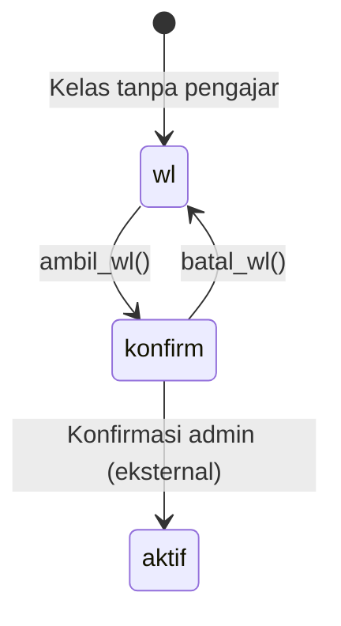

# Fitur 06 — Waiting List

## Ringkasan

Daftar kelas yang belum punya pengajar. Pengajar bisa melihat catatan kelas, **mengambil** kelas (claim), atau **membatalkan** jika status masih `konfirm`.

## File Terkait

| Tipe | Path |
|------|------|
| Controller | `application/controllers/Kelas.php` |
| Model | `application/models/Civitas_model.php` |
| View | `application/views/page/wl.php` |
| Template | `application/views/templates/header.php` |

## Route / Endpoint

| Method | URL | Method | Keterangan |
|--------|-----|--------|------------|
| GET | `/kelas/wl` | `wl()` | Halaman waiting list |
| GET | `/kelas/ambil_wl/{id_kelas}` | `ambil_wl($id)` | Claim kelas |
| GET | `/kelas/batal_wl/{id_kelas}` | `batal_wl($id)` | Batalkan claim |
| POST | `/kelas/get_catatan_kelas` | `get_catatan_kelas()` | AJAX (shared dengan KBM) |

## Status Kelas

| Status | Tampilan | Aksi |
|--------|----------|------|
| `wl` | Waiting list umum | Tombol "ambil kelas" |
| `konfirm` | Sudah diambil, menunggu konfirmasi | Tombol "batalkan" |

## Alur Data Halaman

`Kelas::wl()` menggabungkan 2 sumber (urutan penting):

1. **`get_wl_konfirm($nip)`** — kelas status `konfirm` milik pengajar login
2. **`get_all_wl()`** — kelas status `wl` yang tersedia

## Filter Waiting List

`get_all_wl()` hanya menampilkan kelas yang:
- `kelas.status = 'wl'`
- `pengajar` cocok dengan session `jk` (jenis kelamin) ATAU `pengajar = 'Pria&Wanita'`

Query:
```sql
WHERE (pengajar = :jk OR pengajar = 'Pria&Wanita')
  AND a.status = 'wl'
```

## Ambil Kelas (`ambil_wl`)

```php
// Civitas_model::ambil_kelas_wl($id)
if (kelas.nip IS NULL OR '') {
    UPDATE kelas SET nip = session_id, status = 'konfirm'
    return 1 // success
} else {
    return 0 // gagal, sudah diambil orang lain
}
```

Flash success: "Cek Inbox untuk konfirmasi"

## Batalkan (`batal_wl`)

```php
UPDATE kelas SET status = 'wl', nip = null WHERE id_kelas = :id
```

## Tampilan Kartu

- Program
- Nama peserta (koordinator)
- Tipe kelas (tempat)
- Tombol catatan
- Tombol ambil / batalkan

## AJAX Catatan

Sama dengan fitur KBM:
- POST `id` → return `{ catatan, tempat }` dari tabel `kelas`

## Tabel Database

| Tabel | Kolom |
|-------|-------|
| `kelas` | `id_kelas`, `program`, `status`, `nip`, `pengajar`, `catatan`, `tempat`, `tipe_kelas` |
| `kelas_koor` | Relasi kelas–peserta koordinator |
| `peserta` | `nama_peserta` |

## Sidebar Badge

`$jml_wl = COUNT(get_all_wl())` — hanya WL yang tersedia, tidak termasuk konfirm milik user.

## Diagram Alur



> Transisi `konfirm` → `aktif` tidak ada di codebase pengajar; kemungkinan dilakukan admin.

## Tugas Umum untuk Developer

| Tugas | Petunjuk |
|-------|----------|
| Notifikasi inbox saat ambil WL | Insert ke `inbox` di `ambil_wl()` |
| Lock race condition | Transaksi DB / atomic UPDATE WHERE nip IS NULL |
| Filter program/tipe | Tambah parameter di `get_all_wl()` |

## Testing Manual

1. `/kelas/wl` — kelas WL tampil sesuai jenis kelamin login
2. Ambil kelas → status `konfirm`, NIP terisi
3. Ambil kelas yang sudah diambil → gagal
4. Batalkan → kembali `wl`, nip null
5. Baca catatan via modal AJAX
